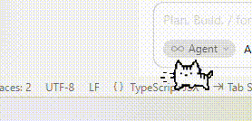

# BatangNyan (바탕화면 고양이)

Windows 바탕화면 위를 돌아다니는 투명 오버레이 고양이.  
*최종 반영: 2026-09-18*

## 데모



---

## 실행

```bash
pip install pillow pystray
python main.py
```

프로젝트 루트에서 실행. 종료: 트레이 → **종료**.

---

## 확정된 결정사항

| 항목 | 내용 |
|------|------|
| 기술 스택 | Python 3 + tkinter + Pillow + pystray |
| 투명 처리 | 색상 키 `KEY_HEX = #fffffe` (`KEY_COLOR`) |
| 스케일 | idle/sit/groom/jump: `SCALE=0.40` / walk: `WALK_SCALE=0.46` / held: `HELD_BODY_SCALE=0.60`(walk 원본 몸통 대비) |
| 이동 | 자동 이동 + 랜덤 상태 전환 + 에너지 |
| 상태 | `walk_r` `walk_l` `idle` `sit` `groom` `jump_r` `jump_l` `held` (+ `sleep`/`stretch` 에셋 있을 때) |
| 클릭 | 창 사각형 클릭 가능 → 집기·드래그 → 놓으면 바닥 + walk |
| 근접 점프 | 커서 진입 시 1회 제자리 점프(커서 반대 방향), 착지 후 그 방향 walk. `held`/`jump_*` 중 제외 |
| 점프 궤적 | 가로 이동 없음(제자리). Y만 포물선 `0→정점→0` |
| 배포 | `python main.py` |
| 트레이 | 보이기/숨기기 / 종료 |

---

## 디렉터리 구조

```
BatangNyan/
├── main.py                 ← 진입점
├── README.md               ← 이 문서
├── cat1.png                ← 트레이 아이콘
├── BatangNyan_test.gif     ← 데모 영상
├── img/                    ← 스프라이트 시트
│   ├── cat-walk-right.png  (8) → walk_r
│   ├── cat-walk-left.png   (8) → walk_l
│   ├── cat-idle-stop.png   (idle: 0–1, sit: 6 / 7은 빈 칸)
│   ├── cat-groom.png       (8) → groom
│   ├── cat-jump-cycle-right.png (6) → jump_r (_pin_jump_frames)
│   ├── cat-jump-cycle-left.png  (6) → jump_l (_pin_jump_frames)
│   └── cat-click.png       (7, gap 분할) → held
└── batang_nyan/            ← 패키지
    ├── __init__.py
    ├── app.py              ← Tk 오버레이, 렌더, 말풍선, 마우스, 커서 폴링
    ├── cat.py              ← 상태 머신 · 이동 · 에너지 · 근접 점프
    ├── held.py             ← HeldMixin (클릭 집기/홀드/릴리즈)
    ├── sprite.py           ← 시트 로드 · 스케일 · 키컬러 · 점프 X 고정
    ├── constants.py        ← 공용 상수 (ROOT=프로젝트 루트)
    ├── win32util.py        ← 투명 창 Invalidate(erase=False)
    └── tray.py             ← 시스템 트레이
```

선택: `img/cat-extra-poses.png`가 있으면 `sleep`(1)·`stretch`(2) 로드.

---

## 모듈 책임

| 모듈 | 역할 |
|------|------|
| `main` | `BatangNyanApp().run()` |
| `batang_nyan.app` | 창·캔버스·페인트·말풍선·클릭/드래그·틱·커서 근접 |
| `batang_nyan.cat` | AI 전환, 걷기/점프/에너지, `try_mouse_scare` |
| `batang_nyan.held` | pickup → frame 4 유지 → release 5→6 → walk |
| `batang_nyan.sprite` | 시트 로드, walk/jump 정렬, unify |
| `batang_nyan.constants` | 스케일·속도·점프·전환·말풍선 |
| `batang_nyan.win32util` | 깜빡임 완화 창 갱신 |
| `batang_nyan.tray` | 트레이 메뉴 |

---

## 스프라이트 처리 요점

- **walk**: 시트에 가로 이동이 베이크됨 → 프레임마다 가로 중앙 정렬 (창 `x`만 이동)
- **jump_r / jump_l**: 시트에 세로·가로 이동이 베이크됨 → `_pin_jump_frames`로 발 바닥 정렬 + 몸통 무게중심 X 고정 후, 창 `jump_y_offset`만으로 포물선. 방향은 walk와 동일하게 분리
- **held (`cat-click`)**: 프레임 간격 불균일 → `load_sheet_gaps`. 표시 높이는 `HELD_BODY_SCALE`
- **idle**: 서기 2프레임 / **sit**: 1프레임 (8번째 칸 비어 있음)
- 모든 상태 프레임은 `_unify_size`로 동일 캔버스

---

## 상태 머신

```
walk_r ──► idle ──► sit ──► groom
  │          │        │
  │          │        └─(에셋 시)─► sleep ──► stretch ──► idle/walk
  │          └──────────────────────────────► walk
  └─ jump_r ──► walk_r
walk_l ──► … 동일, jump_l ──► walk_l
  └─ 커서 근접 시 커서 반대 방향 jump ──► 그 방향 walk
```

| 상태 | 지속(tick) | 비고 |
|------|------------|------|
| `walk_r`/`walk_l` | 30–80 | 속도 1.6–2.8, 가속·벽 근처 감속 |
| `idle` | 15–40 | 홀드 [18, 3] |
| `sit` | 35–90 | 정적 1프레임 |
| `groom` | 24–48 | 프레임별 홀드 |
| `jump_r`/`jump_l` | 시퀀스 완주 | 제자리, Y 포물선 10스텝 → 같은 방향 walk |
| `held` | 입력 종속 | Held 절 참고 |
| `sleep`/`stretch` | 에셋 있을 때만 | |

1 tick = 100ms (`TICK_MS`).

### 전환 가중치

| 현재 | 다음 |
|------|------|
| walk_r | idle(10), jump_r(0.35) |
| walk_l | idle(10), jump_l(0.35) |
| idle | walk_r(4), walk_l(4), sit(3) |
| sit | idle(3), groom(4), sleep(1.5) |
| groom | sit(3), idle(1) |
| sleep | stretch(1) |
| stretch | idle(3), walk_r(2), walk_l(2) |
| jump_r | walk_r(1) |
| jump_l | walk_l(1) |

---

## Jump

- **방향**: `jump_r` / `jump_l` (walk와 동일). 걷기 중 점프는 현재 방향 유지
- **근접**: 커서 반대 방향으로 점프 → 착지 후 그 방향 walk
- **제자리**: 가로 `dx` 없음
- **Y**: `y = -4 * JUMP_PEAK * t * (1-t)`, `JUMP_PEAK=38`, 10스텝  
  → `[0, -15, -26, -34, -38, -38, -34, -26, -15, 0]`
- **포즈**: `JUMP_FRAME_MAP = [0,1,2,2,3,3,4,4,5,5]` (left/right 동일)
- **근접 반경**: ≤ `MOUSE_JUMP_RADIUS`(120) 진입 시 1회, 이탈 `RADIUS+20`

---

## Held (클릭)

1. **누름**: 0→1→2→3 후 **프레임 4 유지** + 드래그  
2. **뗌**: X 유지, Y 바닥 → **5→6** → `walk_r`/`walk_l`

---

## 말풍선

| 시각 | 텍스트 |
|------|--------|
| 9시 | 냥 |
| 12시 | 냐냥 |
| 18시 | 냐냐냥 |

held 중에는 숨김.

---

## 주요 상수 (`batang_nyan/constants.py`)

| 상수 | 값 | 용도 |
|------|-----|------|
| `SCALE` | 0.40 | 기본 시트 |
| `WALK_SCALE` | 0.46 | 걷기만 |
| `HELD_BODY_SCALE` | 0.60 | 클릭 held 몸통 |
| `TICK_MS` | 100 | 루프 주기 |
| `MOUSE_JUMP_RADIUS` | 120 | 근접 진입 |
| `JUMP_PEAK` / `JUMP_STEPS` | 38 / 10 | 포물선 |
